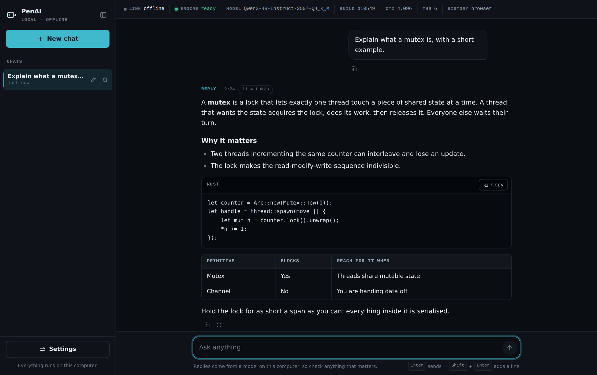
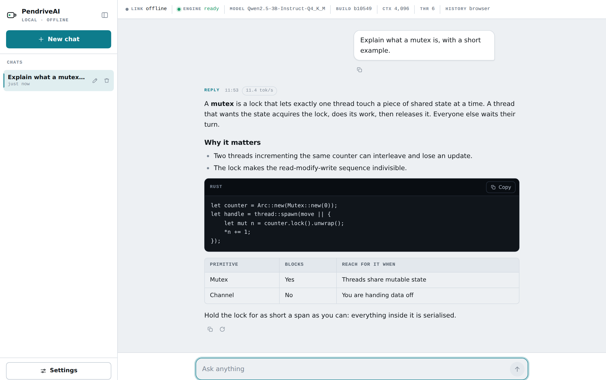

<div align="center">

<picture>
  <source media="(prefers-color-scheme: dark)" srcset="assets/logo-dark.svg">
  
</picture>

**A full local-LLM chat system that lives on a USB pendrive.**
Plug it in, run one launcher, and a chat UI opens in your browser.
No installation, no internet, no admin rights, no Node.js, no Python, no Docker, no cloud API.

<a href="docs/USAGE.md"></a>
<a href="docs/REQUIREMENTS.md"></a>
<a href="docs/OVERVIEW.md"></a>
<a href="launcher/"></a>
<a href="web/"></a>
<a href="LICENSE"></a>

<br>



</div>

---

## What it is

A pendrive carrying three things: a CPU build of **llama.cpp**, one **GGUF
model**, and a small native **launcher** next to a **React** production build.
Any drive with room for the model works; the default build needs about 2.6 GB.

The launcher starts `llama-server` bound to `127.0.0.1`, points it at the model
and at the web build, waits for the engine to report healthy, then opens your
default browser. From there it behaves like a website served from your pocket:
the page and the model API share one local port.

Nothing leaves the machine. No account, no telemetry, and after the drive is
prepared, no network dependency of any kind.

There is one deliberate exception, and it is off until you turn it on: with
`"network": { "enabled": true }` in `config.json`, a globe button appears next to
the composer and you can fetch a page by address. Name a search provider as well
and the same box searches. The model never browses on its own. See
[Fetching a web page](docs/USAGE.md#fetching-a-web-page).

## Quick start

**You have a finished drive:**

```bash
# Linux
/media/you/PENAI/StartAI

# Windows: double-click StartAI.exe, or StartAI.bat if the .exe is absent
```

**You are building one from this repo:**

```bash
./scripts/build-all.sh --target /media/you/PENAI
```

That is the whole build. It fetches the llama.cpp runtimes, builds the web UI,
builds the launcher for Linux and for Windows, downloads and checksums the
model, assembles `release/`, and copies the result onto the drive. Every step
skips itself when its output is already current, so an interrupted run costs
nothing to repeat, and a UI-only change rebuilds only the UI.

> **Format the drive first.** exFAT is what makes the launcher runnable on Linux
> at all. See [Format the pendrive first](docs/PENDRIVE.md#format-the-pendrive-first-do-this-before-anything-else),
> then [From zero to chatting](docs/PENDRIVE.md#from-zero-to-chatting-the-full-checklist).

## What you get

| | |
| --- | --- |
| **Offline unless you say otherwise** | The page's own Content-Security-Policy limits it to `127.0.0.1`. Unplug the network and nothing changes. Optional web fetch is off by default, one page at a time, and never initiated by the model. |
| **Nothing to install** | No runtime on the host machine. No admin rights. No registry, no PATH, no leftovers. |
| **Portable history** | Chats are written to the drive as JSON, so they travel with it, with an IndexedDB copy for speed. |
| **Honest about the machine** | The readout strip shows the live engine state, the model file, the llama.cpp build, the real context size and where history is stored. |
| **Streaming replies** | Server-Sent Events with a working stop button that frees the engine slot. |
| **Markdown and code** | Headings, lists, tables and fenced code blocks with copy buttons. |
| **Light and dark** | Follows the system theme, or pick one in Settings. |
| **Keyboard-first** | Enter sends, Shift+Enter adds a line, Escape closes dialogs, and every control is reachable by tab. |

<div align="center">

</div>

## Documentation

Full documentation lives in [`docs/`](docs/README.md).

| Document | Read it when |
| --- | --- |
| [Status](docs/STATUS.md) | You want to know what is actually verified. |
| [Overview](docs/OVERVIEW.md) | You want the design in one sitting. |
| [Requirements](docs/REQUIREMENTS.md) | You are choosing a drive or a machine. |
| [Model setup](docs/MODELS.md) | You are choosing or swapping the GGUF model. |
| [Preparing the pendrive](docs/PENDRIVE.md) | You have a blank drive to format and load. |
| [Building a release](docs/BUILD.md) | You are building from source. |
| [Development setup](docs/DEVELOPMENT.md) | You are changing the code. |
| [Running PenAI](docs/USAGE.md) | You have a drive and want to start it. |
| [Troubleshooting](docs/TROUBLESHOOTING.md) | Something did not work. |
| [Privacy and security](docs/PRIVACY.md) | You need to explain what leaves the machine. |
| [Known limitations](docs/LIMITATIONS.md) | You are wondering if something is missing on purpose. |
| [Architecture](docs/ARCHITECTURE.md) | You want the reasoning behind each decision. |
| [Testing](docs/TESTING.md) | You want the measurements and the test matrix. |

## Repository layout

```
assets/      Logo and brand marks
config/      Default config.json shipped on the drive
docs/        All documentation, plus the screenshots in this file
launcher/    The Rust launcher: StartAI and StartAI.exe
models/      Model download and checksum scripts
release/     Build output: the folder that gets copied to the drive
scripts/     build-all.sh and the individual build steps
site/        The hostable marketing page and documentation site
tests/       Integration tests
web/         The React UI served by llama-server
```

## Status

Verified on Linux x86_64 with the real model: engine start, streaming, stop,
13.2 tokens/second generation, 85 launcher unit tests, and real pendrive
filesystem behaviour. Windows end to end and macOS are not tested.

The full breakdown is in [Status](docs/STATUS.md), with measurements in
[Testing](docs/TESTING.md).

## Licence

MIT. See [`LICENSE`](LICENSE).

The model, Qwen3-4B-Instruct-2507, is Apache-2.0 and is not included in this
repository. llama.cpp is distributed under its own licence by `ggml-org/llama.cpp`.
